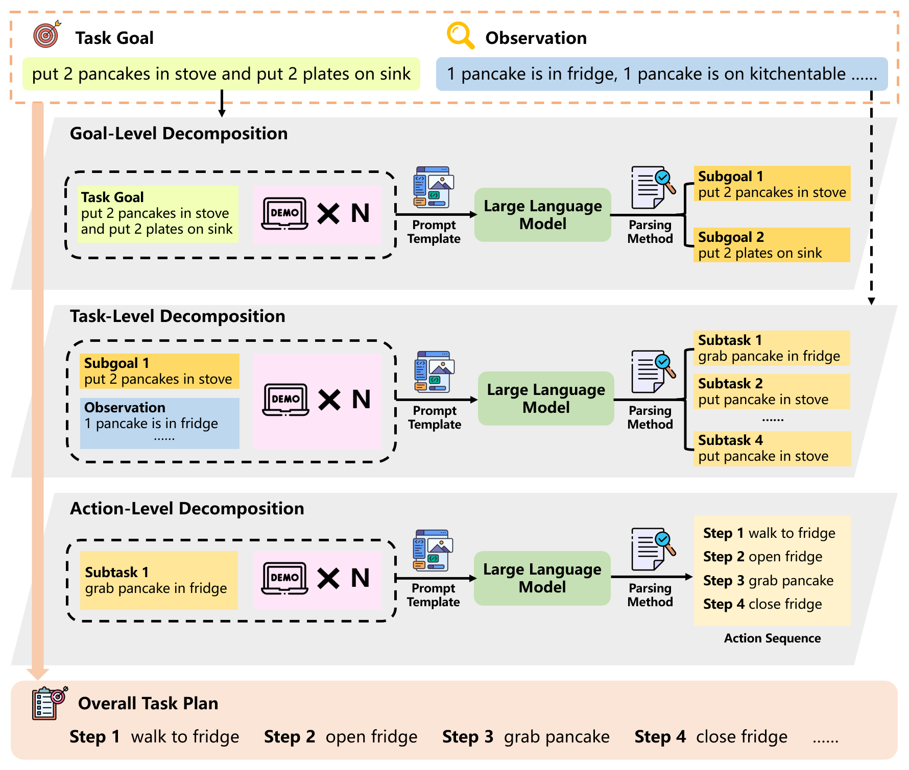

# MLDT: Multi-Level Decomposition for Complex Long-Horizon Robotic Task Planning with Open-Source Large Language Model

> **Abstract**
In the realm of data-driven AI technology, the application of open-source large language models (LLMs) in robotic task planning represents a significant milestone. Recent robotic task planning methods based on open-source LLMs typically leverage vast task planning datasets to enhance models’ planning abilities. While these methods show promise, they struggle with complex long-horizon tasks, which require comprehending more context and generating longer action sequences. This paper addresses this limitation by proposing MLDT, the Multi-Level Decomposition Task planning method. This method innovatively decomposes tasks at the goal-level, task-level, and action-level to mitigate the challenge of complex long-horizon tasks. In order to enhance open-source LLMs’ planning abilities, we introduce a goal-sensitive corpus generation method to create high-quality training data and conduct instruction tuning on the generated corpus. Since the complexity of the existing datasets is not high enough, we construct a more challenging dataset, LongTasks, to specifically evaluate planning ability on complex long-horizon tasks. We evaluate our method using various LLMs on four datasets in VirtualHome. Our results demonstrate a significant performance enhancement in robotic task planning, showcasing MLDT’s effectiveness in overcoming the limitations of existing methods based on open-source LLMs as well as its practicality in complex, real-world scenarios.
> 

This is the accompanying code for the paper "MLDT: Multi-Level Decomposition for Complex Long-Horizon Robotic Task Planning with Open-Source Large Language Model"

## Setup
### Environment Setup
```
conda create -n MLDT python=3.10
conda activate MLDT
pip install -r requirement.txt
```
### VirtualHome Setup
We conduct experiments in VirtualHome. Download VirtualHome exectuable file (v2.2.5) from [here](https://1drv.ms/u/s!Am9fgKqXV2C2bB8WJWKb4-NABSg?e=8FJOUA) and unzip it to ```MLDT/MLDT/virtualhome``` 
```
MLDT/
└── MLDT/
    ├── virtualhome/                                                          
```
### LLM Setup
We employ various LLMs of different scales as the backbone, including 

## Dataset
We evaluate our method on four datasets, three (In-Distribution, NovelScenes, NovelTasks) from [LID](https://github.com/ShuangLI59/Pre-Trained-Language-Models-for-Interactive-Decision-Making) and one (LongTasks) created by ourselves. Download the four datasets from [here](https://1drv.ms/u/s!AvfJPiUjTsi_aYQaFwohMS7NA2s?e=tZkalm) and unzip it to ```MLDT/MLDT/data/test_init_env```
```
MLDT/
└── MLDT/
    ├── data/                  
        ├── test_init_env/                                        
```                                                     
You can run ```MLDT/MLDT/data/create_long.py``` to create the LongTasks dataset. We remove some samples due to the environment bug from LID.

## Goal-sensitive Corpus Generation
We provide all the instruction datasets for different methods in ```MLDT/Instruction-Tuning```: "multi-layer" for "MLDT", "react" for "ReAct", "embodied" for "Embodied", "task-action" for "MLDT<sub>-goal</sub>", "goal-action" for "MLDT<sub>-task</sub>".
You can go to ```MLDT/MLDT/task-planning/``` directory and run ```bash scripts/llm_collection.sh``` to generate the training corpus for "MLDT". You can judge the parameters like "subset", "max_retry" to generate your own data. For other methods, you can either modify the python scripts to generate from scratch or use some tricks like regular expressions to obtain based on the generated corpus.

## Instruction Tuning
Run the 
